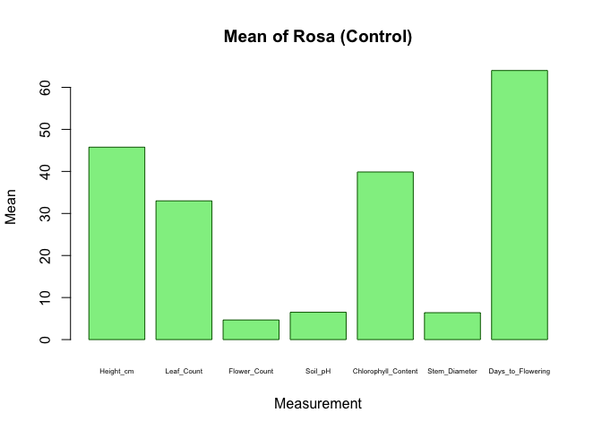
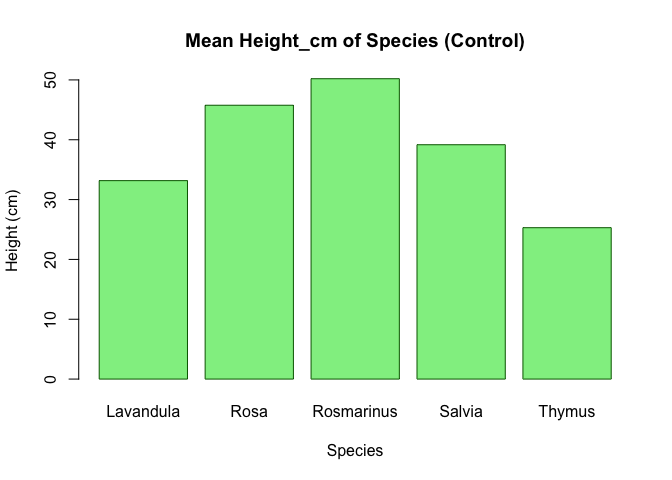
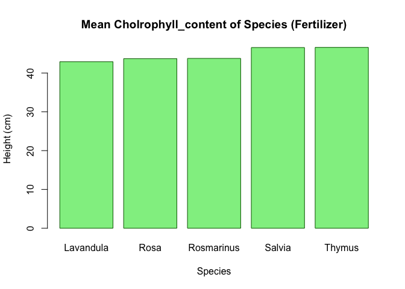
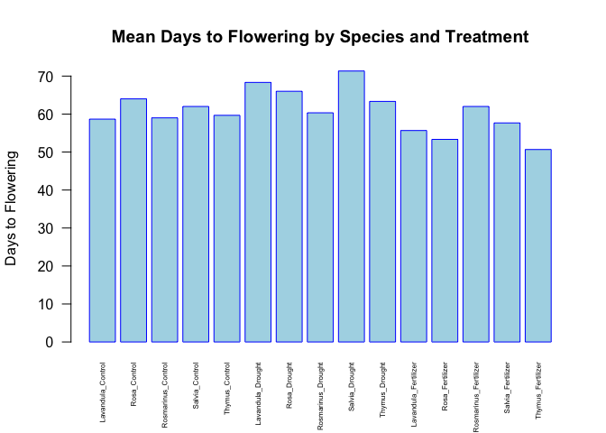

Assigment
================
2025-05-04

``` r
plant_growth_data <- read.csv("plant_growth_data.csv")
```

``` r
head(plant_growth_data)
```

    ##   Plant_ID Species  Treatment Height_cm Leaf_Count Flower_Count Soil_pH
    ## 1        1    Rosa    Control      43.3         29            5     6.7
    ## 2        2    Rosa    Control      44.3         33            5     6.2
    ## 3        3    Rosa    Control      49.7         37            4     6.6
    ## 4        4    Rosa Fertilizer      53.2         46            6     7.2
    ## 5        5    Rosa Fertilizer      53.4         42            9     6.5
    ## 6        6    Rosa Fertilizer      58.1         48            6     6.9
    ##   Chlorophyll_Content Stem_Diameter Days_to_Flowering
    ## 1                36.8           6.6                64
    ## 2                43.8           5.9                65
    ## 3                39.0           6.7                63
    ## 4                42.4           8.9                48
    ## 5                44.3           7.0                59
    ## 6                44.4          10.7                53

``` r
library(dplyr)
```

    ## 
    ## Attaching package: 'dplyr'

    ## The following objects are masked from 'package:stats':
    ## 
    ##     filter, lag

    ## The following objects are masked from 'package:base':
    ## 
    ##     intersect, setdiff, setequal, union

``` r
library(ggplot2)
```

\#คำตอบข้อที่ 1หาค่าเฉลี่ยของ Height_cm, Leaf_Count, Flower_Count, Soil_pH,
Chlorophyll_Content, Stem_Diameter และ Days_to_Flowering สำหรับแต่ละ
Species และ Treatment

``` r
# เลือกข้อมูลในคอร์ลัม Treatment ได้แก่ Fertilizer control Drought
filtered_df <- filter(plant_growth_data,(Treatment == "Fertilizer" | Treatment == "Control" | Treatment == "Drought")
)
```

``` r
# เลือก Specie
filtered_df <- filter(
  plant_growth_data,
  (Species == "Rosa" | Species == "Lavandula" | Species == "Salvia" | 
   Species == "Thymus" | Species == "Rosmarinus"))
```

``` r
# จัดกลุ่มข้อมูล
grouped_df <- group_by(filtered_df, Species, Treatment)

# สรุปค่าเฉลี่ยของแต่ละตัวแปร
avg_df <- summarise(
  grouped_df,
  Height_cm = mean(Height_cm),
  Leaf_Count = mean(Leaf_Count),
  Flower_Count = mean(Flower_Count),
  Soil_pH = mean(Soil_pH),
  Chlorophyll_Content = mean(Chlorophyll_Content),
  Stem_Diameter = mean(Stem_Diameter),
  Days_to_Flowering = mean(Days_to_Flowering)
)
```

    ## `summarise()` has grouped output by 'Species'. You can override using the
    ## `.groups` argument.

``` r
# แสดงผลลัพธ์
print(avg_df)
```

    ## # A tibble: 15 × 9
    ## # Groups:   Species [5]
    ##    Species    Treatment  Height_cm Leaf_Count Flower_Count Soil_pH
    ##    <chr>      <chr>          <dbl>      <dbl>        <dbl>   <dbl>
    ##  1 Lavandula  Control         33.2       26           9       6.27
    ##  2 Lavandula  Drought         25.3       19.7         6.67    6.57
    ##  3 Lavandula  Fertilizer      39.9       33.7        12.3     6.87
    ##  4 Rosa       Control         45.8       33           4.67    6.5 
    ##  5 Rosa       Drought         36.5       31.3         3.67    6.17
    ##  6 Rosa       Fertilizer      54.9       45.3         7       6.87
    ##  7 Rosmarinus Control         50.2       41.3         5.67    6.63
    ##  8 Rosmarinus Drought         45.1       38.3         2.67    6.43
    ##  9 Rosmarinus Fertilizer      56.7       47          10       6.7 
    ## 10 Salvia     Control         39.2       28.7         7.67    6.4 
    ## 11 Salvia     Drought         31.5       24           6.33    6.37
    ## 12 Salvia     Fertilizer      46         39          10.7     6.87
    ## 13 Thymus     Control         25.3       19.7        13.7     6.57
    ## 14 Thymus     Drought         20.4       16.3        13.7     6.47
    ## 15 Thymus     Fertilizer      34.0       26.3        17.3     6.83
    ## # ℹ 3 more variables: Chlorophyll_Content <dbl>, Stem_Diameter <dbl>,
    ## #   Days_to_Flowering <dbl>

# คำตอบข้อที่ 2 สร้าง data frame ใหม่ที่ประกอบด้วย Species, Treatment และค่าเฉลี่ยของพารามิเตอร์แต่ละตัว ใช้ head() เพื่อแสดง data frame ใหม่ของคุณ

``` r
new_dataframe <- avg_df[ , c("Species", "Treatment", 
                      "Height_cm", "Leaf_Count", "Flower_Count", 
                      "Soil_pH", "Chlorophyll_Content", 
                      "Stem_Diameter", "Days_to_Flowering")]

head(new_dataframe)
```

    ## # A tibble: 6 × 9
    ## # Groups:   Species [2]
    ##   Species   Treatment  Height_cm Leaf_Count Flower_Count Soil_pH
    ##   <chr>     <chr>          <dbl>      <dbl>        <dbl>   <dbl>
    ## 1 Lavandula Control         33.2       26           9       6.27
    ## 2 Lavandula Drought         25.3       19.7         6.67    6.57
    ## 3 Lavandula Fertilizer      39.9       33.7        12.3     6.87
    ## 4 Rosa      Control         45.8       33           4.67    6.5 
    ## 5 Rosa      Drought         36.5       31.3         3.67    6.17
    ## 6 Rosa      Fertilizer      54.9       45.3         7       6.87
    ## # ℹ 3 more variables: Chlorophyll_Content <dbl>, Stem_Diameter <dbl>,
    ## #   Days_to_Flowering <dbl>

# คำตอบข้อที่ 3 พล็อตกราฟแท่งของ Height_cm, Leaf_Count, Flower_Count, Soil_pH, Chlorophyll_Content, Stem_Diameter และ Days_to_Flowering ใน Rosa/Control (ใช้ค่าเฉลี่ยของแต่ละการวัด)

``` r
# เลือก Rosa และ Control
filtered_df <- filter(
  plant_growth_data,
  Species == "Rosa" & Treatment == "Control"
)
```

``` r
# คำนวณค่าเฉลี่ยสำหรับแต่ละพารามิเตอร์
avg_df <- summarise(
  filtered_df,
  Height_cm = mean(Height_cm),
  Leaf_Count = mean(Leaf_Count),
  Flower_Count = mean(Flower_Count),
  Soil_pH = mean(Soil_pH),
  Chlorophyll_Content = mean(Chlorophyll_Content),
  Stem_Diameter = mean(Stem_Diameter),
  Days_to_Flowering = mean(Days_to_Flowering)
)
```

``` r
# ดึงเฉพาะค่าตัวเลขจาก avg_df
avg_values <- as.numeric(avg_df[1, ])
parameter_names <- names(avg_df)

# สร้างกราฟแท่ง
barplot(avg_values,
        names.arg = parameter_names,
        main = "Mean of Rosa (Control)",
        xlab = "Measurement",
        ylab = "Mean",
        col = "lightgreen",
        border = "darkgreen",
        cex.names = 0.5)  # ลดขนาด name parameter
```

<!-- -->

\#คำตอบข้อที่ 4 เปรียบเทียบค่าเฉลี่ยของ Height_cm ระหว่าง Species ในกลุ่ม control
โดยใช้กราฟแท่ง

``` r
# เลือก Species และ Treatment เป็น "Control"
filtered_df <- plant_growth_data[
  (plant_growth_data$Species == "Rosa" |
   plant_growth_data$Species == "Lavandula" |
   plant_growth_data$Species == "Salvia" |
   plant_growth_data$Species == "Thymus" |
   plant_growth_data$Species == "Rosmarinus") &
   plant_growth_data$Treatment == "Control", ]
```

``` r
# คำนวณค่าเฉลี่ย Height_cm แยกตาม Species
avg_df <- aggregate(Height_cm ~ Species, data = filtered_df, FUN = mean)
```

``` r
# สร้าง bar plot
barplot(avg_df$Height_cm, 
        names.arg = avg_df$Species,
        main = "Mean Height_cm of Species (Control)",
        xlab = "Species",
        ylab = "Height (cm)",
        col = "lightgreen",
        border = "darkgreen",
        )
```

<!-- -->

\#คำตอบข้อที่ 5 เปรียบเทียบค่าเฉลี่ยของ Chlorophyll_Content ระหว่าง Species ในกลุ่ม
fertilizer โดยใช้กราฟแท่ง

``` r
# เลือก Species และ Treatment เป็น Fertilizer
filtered_df <- plant_growth_data[
  (plant_growth_data$Species == "Rosa" |
   plant_growth_data$Species == "Lavandula" |
   plant_growth_data$Species == "Salvia" |
   plant_growth_data$Species == "Thymus" |
   plant_growth_data$Species == "Rosmarinus") &
   plant_growth_data$Treatment == "Fertilizer", ]
```

``` r
# คำนวณค่าเฉลี่ย Chlorophyll_content แยกตาม Species. 
avg_df <- aggregate(Chlorophyll_Content ~ Species, data = filtered_df, FUN = mean)
```

``` r
# สร้าง bar plot
barplot(avg_df$Chlorophyll_Content, 
        names.arg = avg_df$Species,
        main = "Mean Cholrophyll_content of Species (Fertilizer)",
        xlab = "Species",
        ylab = "Height (cm)",
        col = "lightgreen",
        border = "darkgreen",
        )
```

<!-- -->

\#คำตอบข้อที่ 6 เปรียบเทียบค่าเฉลี่ยของ Days_to_Flowering ของทุก Species และ
Treatment โดยใช้กราฟแท่ง

``` r
# เลือกข้อมูล Species และ Treatment 
filtered_df <- plant_growth_data[
  (plant_growth_data$Species == "Rosa" |
   plant_growth_data$Species == "Lavandula" |
   plant_growth_data$Species == "Salvia" |
   plant_growth_data$Species == "Thymus" |
   plant_growth_data$Species == "Rosmarinus") &
  (plant_growth_data$Treatment == "Control" |
   plant_growth_data$Treatment == "Fertilizer" |
   plant_growth_data$Treatment == "Drought"), ]
```

``` r
# คำนวณค่าเฉลี่ย Days_to_Flowering แยกตาม Species และ Treatment
avg_df <- aggregate(Days_to_Flowering ~ Species + Treatment, data = filtered_df, FUN = mean)
```

``` r
# สร้างกลุ่ม Species และ Treatment สำหรับใช้ในกราฟ
group_labels <- paste(avg_df$Species, avg_df$Treatment, sep = "_")
```

``` r
# สร้าง bar plot
barplot(avg_df$Days_to_Flowering,
        names.arg = group_labels,
        main = "Mean Days to Flowering by Species and Treatment",
        xlab = "",
        ylab = "Days to Flowering",
        col = "lightblue",
        border = "blue",
        las = 2, # หมุนชื่อให้อ่่านง่าย
        cex.names = 0.5)  # ลดขนาด name
```

<!-- -->
