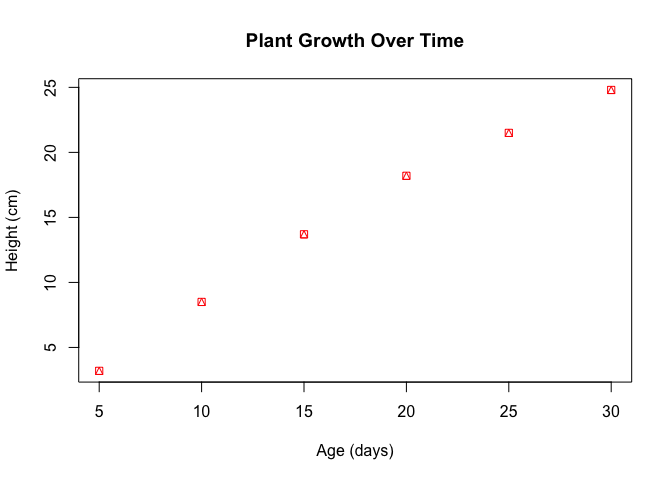
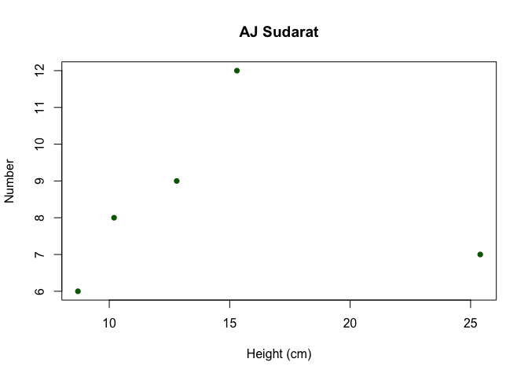
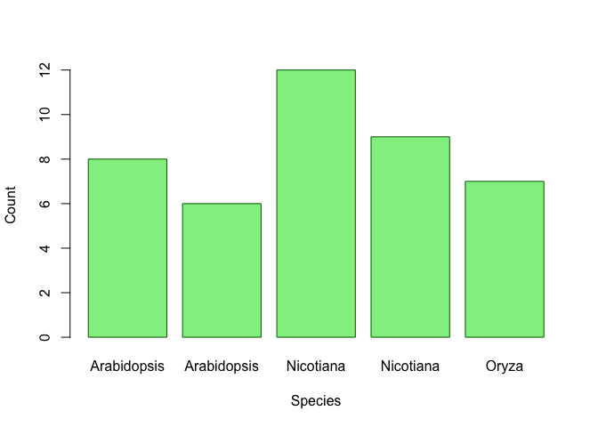
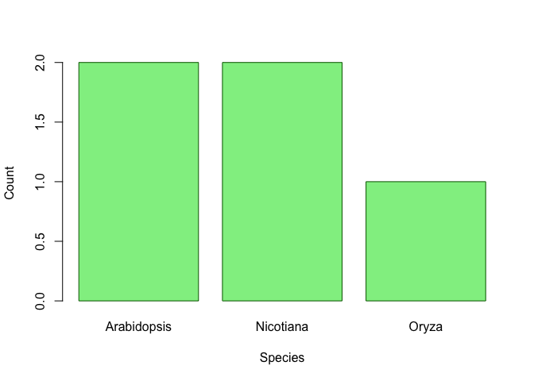
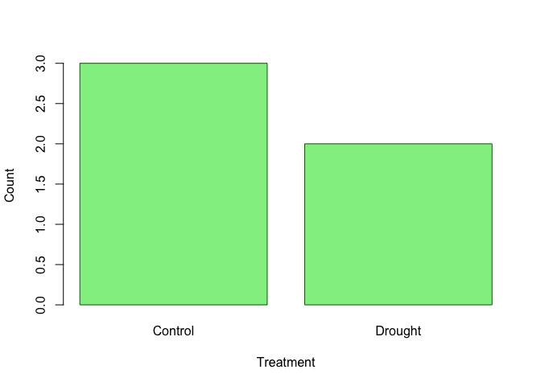

Rmarkdown
================
2025-05-02

การคำนวณใน R

``` r
1+1
```

    ## [1] 2

``` r
2*2
```

    ## [1] 4

``` r
2/3
```

    ## [1] 0.6666667

variable (ตัวแปร)

``` r
plant_height <- 10.5
plant_height
```

    ## [1] 10.5

``` r
total_height <- plant_height * 2
total_height
```

    ## [1] 21

``` r
plant_height  <- c(10.5, 20.5, 12.5, 8.5)
plant_height * 10
```

    ## [1] 105 205 125  85

``` r
#plant_height * leaf_count
```

``` r
plant_height_2 <- c(200, 300,500, 1000)
plant_height + plant_height_2
```

    ## [1]  210.5  320.5  512.5 1008.5

``` r
plant_height * plant_height_2
```

    ## [1] 2100 6150 6250 8500

``` r
plant_height_2 <- plant_height_2 + 1000
plant_height_2
```

    ## [1] 1200 1300 1500 2000

``` r
weight <- 2.5
class(weight)
```

    ## [1] "numeric"

``` r
class(plant_height)
```

    ## [1] "numeric"

``` r
count <- 10L  # The L suffix creates an integer
count
```

    ## [1] 10

``` r
class(count)
```

    ## [1] "integer"

``` r
count + 10
```

    ## [1] 20

``` r
count <- "10L"  # The L suffix creates an integer
count
```

    ## [1] "10L"

``` r
class(count)
```

    ## [1] "character"

``` r
#count + 10
```

``` r
# Logical (TRUE/FALSE)
is_flowering <- "TRUE"
class(is_flowering)
```

    ## [1] "character"

``` r
# Create a vector of plant heights (cm)
heights <- c(10.2, 15.7, 12.3, 9.8, 11.5)
heights
```

    ## [1] 10.2 15.7 12.3  9.8 11.5

``` r
# Create a vector of species names
species <- c("Arabidopsis", "Nicotiana", "Oryza", "Zea", "Solanum")
species
```

    ## [1] "Arabidopsis" "Nicotiana"   "Oryza"       "Zea"         "Solanum"

``` r
heights
```

    ## [1] 10.2 15.7 12.3  9.8 11.5

``` r
heights[3]
```

    ## [1] 12.3

``` r
heights[2:4]
```

    ## [1] 15.7 12.3  9.8

``` r
heights[c(2,4)]
```

    ## [1] 15.7  9.8

``` r
heights[-c(2,4)]
```

    ## [1] 10.2 12.3 11.5

``` r
species[3]
```

    ## [1] "Oryza"

``` r
species
```

    ## [1] "Arabidopsis" "Nicotiana"   "Oryza"       "Zea"         "Solanum"

``` r
species[3]
```

    ## [1] "Oryza"

``` r
species[2:4]
```

    ## [1] "Nicotiana" "Oryza"     "Zea"

``` r
species[c(2,4)]
```

    ## [1] "Nicotiana" "Zea"

``` r
species[-c(2,4)]
```

    ## [1] "Arabidopsis" "Oryza"       "Solanum"

``` r
heights
```

    ## [1] 10.2 15.7 12.3  9.8 11.5

``` r
mean(heights)
```

    ## [1] 11.9

``` r
mean(heights)
```

    ## [1] 11.9

``` r
median(heights)
```

    ## [1] 11.5

``` r
min(heights)
```

    ## [1] 9.8

``` r
max(heights)
```

    ## [1] 15.7

``` r
sum(heights)
```

    ## [1] 59.5

``` r
length(heights)
```

    ## [1] 5

``` r
# Create a factor for treatment groups
treatments <- factor(c("Control", "Treatment A", "Treatment B", "Control", "Treatment A"))
treatments
```

    ## [1] Control     Treatment A Treatment B Control     Treatment A
    ## Levels: Control Treatment A Treatment B

``` r
treatments_2 <- c("Control", "Treatment A", "Treatment B", "Control", "Treatment A")
treatments_2
```

    ## [1] "Control"     "Treatment A" "Treatment B" "Control"     "Treatment A"

``` r
## [1] Control     Treatment A Treatment B Control     Treatment A
## Levels: Control Treatment A Treatment B
# Check the levels
levels(treatments)
```

    ## [1] "Control"     "Treatment A" "Treatment B"

``` r
table(treatments)
```

    ## treatments
    ##     Control Treatment A Treatment B 
    ##           2           2           1

``` r
# Create a factor for grade
grade <- c("Control", "A", "B", "F","F","c","C")
grade_1 <-factor(grade)
grade_1
```

    ## [1] Control A       B       F       F       c       C      
    ## Levels: A B c C Control F

``` r
grade_2 <- factor(grade, levels = c("A","B","C","D","F"))
grade_1
```

    ## [1] Control A       B       F       F       c       C      
    ## Levels: A B c C Control F

``` r
grade_2 
```

    ## [1] <NA> A    B    F    F    <NA> C   
    ## Levels: A B C D F

``` r
table(grade_1)
```

    ## grade_1
    ##       A       B       c       C Control       F 
    ##       1       1       1       1       1       2

``` r
table(grade_2)
```

    ## grade_2
    ## A B C D F 
    ## 1 1 1 0 2

``` r
# Create a data frame for an experiment
experiment <- data.frame(
  Plant_ID = 1:5, #หรือc(1,2,3,4,5)
  Species = c("Arabidopsis", "Arabidopsis", "Nicotiana", "Nicotiana", "Oryza"),
  Treatment = c("Control", "Drought", "Control", "Drought", "Control"),
  Height = c(10.2, 8.7, 15.3, 12.8, 25.4),
  Leaf_Count = c(8, 6, 12, 9, 7)
)

# View the data frame
experiment
```

    ##   Plant_ID     Species Treatment Height Leaf_Count
    ## 1        1 Arabidopsis   Control   10.2          8
    ## 2        2 Arabidopsis   Drought    8.7          6
    ## 3        3   Nicotiana   Control   15.3         12
    ## 4        4   Nicotiana   Drought   12.8          9
    ## 5        5       Oryza   Control   25.4          7

``` r
tmp<-experiment$Plant_ID
tmp
```

    ## [1] 1 2 3 4 5

``` r
tmp<-tmp+5
tmp
```

    ## [1]  6  7  8  9 10

``` r
experiment$Plant_ID <- tmp
experiment
```

    ##   Plant_ID     Species Treatment Height Leaf_Count
    ## 1        6 Arabidopsis   Control   10.2          8
    ## 2        7 Arabidopsis   Drought    8.7          6
    ## 3        8   Nicotiana   Control   15.3         12
    ## 4        9   Nicotiana   Drought   12.8          9
    ## 5       10       Oryza   Control   25.4          7

``` r
experiment$Plant_ID <- c(1,2,3,4,5)
experiment
```

    ##   Plant_ID     Species Treatment Height Leaf_Count
    ## 1        1 Arabidopsis   Control   10.2          8
    ## 2        2 Arabidopsis   Drought    8.7          6
    ## 3        3   Nicotiana   Control   15.3         12
    ## 4        4   Nicotiana   Drought   12.8          9
    ## 5        5       Oryza   Control   25.4          7

``` r
experiment[2,]
```

    ##   Plant_ID     Species Treatment Height Leaf_Count
    ## 2        2 Arabidopsis   Drought    8.7          6

``` r
experiment[2:4,2:3]
```

    ##       Species Treatment
    ## 2 Arabidopsis   Drought
    ## 3   Nicotiana   Control
    ## 4   Nicotiana   Drought

``` r
experiment[,2:3]
```

    ##       Species Treatment
    ## 1 Arabidopsis   Control
    ## 2 Arabidopsis   Drought
    ## 3   Nicotiana   Control
    ## 4   Nicotiana   Drought
    ## 5       Oryza   Control

``` r
experiment[c(2:4),2:3]
```

    ##       Species Treatment
    ## 2 Arabidopsis   Drought
    ## 3   Nicotiana   Control
    ## 4   Nicotiana   Drought

``` r
experiment[2:3,]
```

    ##   Plant_ID     Species Treatment Height Leaf_Count
    ## 2        2 Arabidopsis   Drought    8.7          6
    ## 3        3   Nicotiana   Control   15.3         12

``` r
experiment[,2:3]
```

    ##       Species Treatment
    ## 1 Arabidopsis   Control
    ## 2 Arabidopsis   Drought
    ## 3   Nicotiana   Control
    ## 4   Nicotiana   Drought
    ## 5       Oryza   Control

``` r
experiment[c(2:4),2:3]
```

    ##       Species Treatment
    ## 2 Arabidopsis   Drought
    ## 3   Nicotiana   Control
    ## 4   Nicotiana   Drought

``` r
# Get summary statistics for all columns
summary(experiment)
```

    ##     Plant_ID   Species           Treatment             Height     
    ##  Min.   :1   Length:5           Length:5           Min.   : 8.70  
    ##  1st Qu.:2   Class :character   Class :character   1st Qu.:10.20  
    ##  Median :3   Mode  :character   Mode  :character   Median :12.80  
    ##  Mean   :3                                         Mean   :14.48  
    ##  3rd Qu.:4                                         3rd Qu.:15.30  
    ##  Max.   :5                                         Max.   :25.40  
    ##    Leaf_Count  
    ##  Min.   : 6.0  
    ##  1st Qu.: 7.0  
    ##  Median : 8.0  
    ##  Mean   : 8.4  
    ##  3rd Qu.: 9.0  
    ##  Max.   :12.0

``` r
experiment[2, 4]  # Row 2, Column 4
```

    ## [1] 8.7

``` r
experiment[1:3, c("Species", "Height")]  # Rows 1-3, columns "Species" and "Height"
```

    ##       Species Height
    ## 1 Arabidopsis   10.2
    ## 2 Arabidopsis    8.7
    ## 3   Nicotiana   15.3

``` r
# Create a list containing different types of data
plant_data <- list(
  id = "AT001",
  species = "Arabidopsis thaliana",
  heights = c(10.2, 11.5, 9.8),
  is_model_organism = TRUE,
  germination_rates = data.frame(
    temperature = c(20, 25, 30),
    rate = c(0.82, 0.95, 0.78)
  )
)

# Access list elements
plant_data$species
```

    ## [1] "Arabidopsis thaliana"

``` r
id = "AT001"
species = "Arabidopsis thaliana"
heights = c(10.2, 11.5, 9.8)
is_model_organism = TRUE


temperature = c(20, 25, 30)
rate = c(0.82, 0.95, 0.78)
germination_rates <- data.frame(temperature)
plant_data <- list(id, species, heights, is_model_organism, germination_rates)
plant_data
```

    ## [[1]]
    ## [1] "AT001"
    ## 
    ## [[2]]
    ## [1] "Arabidopsis thaliana"
    ## 
    ## [[3]]
    ## [1] 10.2 11.5  9.8
    ## 
    ## [[4]]
    ## [1] TRUE
    ## 
    ## [[5]]
    ##   temperature
    ## 1          20
    ## 2          25
    ## 3          30

``` r
id = "AT001"
species = "Arabidopsis thaliana"
heights = c(10.2, 11.5, 9.8)
is_model_organism = TRUE


temperature = c(20, 25, 30)
rate = c(0.82, 0.95, 0.78)
germination_rates <- data.frame(temperature,rate)
plant_data <- list(id_1 = id, species1 = species, heights1 = heights, is_model_organism1 = is_model_organism, germination_rates1 = germination_rates)
plant_data
```

    ## $id_1
    ## [1] "AT001"
    ## 
    ## $species1
    ## [1] "Arabidopsis thaliana"
    ## 
    ## $heights1
    ## [1] 10.2 11.5  9.8
    ## 
    ## $is_model_organism1
    ## [1] TRUE
    ## 
    ## $germination_rates1
    ##   temperature rate
    ## 1          20 0.82
    ## 2          25 0.95
    ## 3          30 0.78

``` r
plant_data$germination_rates1
```

    ##   temperature rate
    ## 1          20 0.82
    ## 2          25 0.95
    ## 3          30 0.78

``` r
# Create some data
plant_age <- c(5, 10, 15, 20, 25, 30)
plant_size <- c(3.2, 8.5, 13.7, 18.2, 21.5, 24.8)

# Create a basic scatter plot
plot(plant_age, plant_size, 
     main = "Plant Growth Over Time",
     xlab = "Age (days)",
     ylab = "Height (cm)",
     col = "red",
     pch = 14)  # pch controls the point shape
```

<!-- -->

``` r
# Create a basic scatter plot
plot(experiment$Height, experiment$Leaf_Count,
     main = "AJ Sudarat",
     xlab = "Height (cm)",
     ylab = "Number",
     col = "darkgreen",
     pch = 16)  # pch controls the point shape
```

<!-- -->

``` r
# Create data for a bar plot
#species_counts <- c(15, 23, 8, 12)
#species_names <- c("Arabidopsis", "Nicotiana", "Oryza", "Zea")

# Create a bar plot
barplot(experiment$Leaf_Count, 
        names.arg = experiment$Species,
        main = "",
        xlab = "Species",
        ylab = "Count",
        col = "lightgreen",
        border = "darkgreen")
```

<!-- -->

``` r
table(experiment$Species)
```

    ## 
    ## Arabidopsis   Nicotiana       Oryza 
    ##           2           2           1

``` r
tmp<- table(experiment$Species)
tmp
```

    ## 
    ## Arabidopsis   Nicotiana       Oryza 
    ##           2           2           1

``` r
names(tmp)
```

    ## [1] "Arabidopsis" "Nicotiana"   "Oryza"

``` r
# Create a bar plot
barplot(tmp, 
        names.arg = names(tmp),
        main = "",
        xlab = "Species",
        ylab = "Count",
        col = "lightgreen",
        border = "darkgreen")
```

<!-- -->

``` r
tmp<- table(experiment$Treatment)
tmp
```

    ## 
    ## Control Drought 
    ##       3       2

``` r
names(tmp)
```

    ## [1] "Control" "Drought"

``` r
# Create a bar plot
barplot(tmp, 
        names.arg = names(tmp),
        main = "",
        xlab = "Treatment",
        ylab = "Count",
        col = "lightgreen",
        border = "darkgreen")
```

<!-- -->

``` r
# Create some data
treatment_A <- c(12.3, 14.5, 13.8, 15.2, 11.9, 13.7)
treatment_B <- c(15.8, 16.2, 14.9, 17.3, 16.5, 15.9)
treatment_C <- c(10.2, 11.5, 9.8, 10.5, 12.1, 11.3)

# Combine data for boxplot
all_data <- list(
  "Control" = treatment_A,
  "Fertilizer" = treatment_B,
  "Drought" = treatment_C
)
dat2<-data.frame(control = treatment_A, 
                 Fertilizer = treatment_B, 
                 Drought = treatment_C)
# Create a boxplot
boxplot(all_data,
        main = "Plant Heights by Treatment",
        ylab = "Height (cm)",
        col = c("lightblue", "lightgreen", "salmon"))
```

<!-- -->

``` r
# Create two groups for comparison
control <- c(5.2, 5.5, 5.0, 5.8, 5.3, 5.1, 5.6)
treatment <- c(6.5, 6.2, 6.8, 6.1, 6.7, 6.3, 6.5)
dat2
```

    ##   control Fertilizer Drought
    ## 1    12.3       15.8    10.2
    ## 2    14.5       16.2    11.5
    ## 3    13.8       14.9     9.8
    ## 4    15.2       17.3    10.5
    ## 5    11.9       16.5    12.1
    ## 6    13.7       15.9    11.3

``` r
# Perform a t-test
t_test_result <- t.test(dat2$Fertilizer, dat2$control)

# View the result
t_test_result
```

    ## 
    ##  Welch Two Sample t-test
    ## 
    ## data:  dat2$Fertilizer and dat2$control
    ## t = 4.1511, df = 8.4347, p-value = 0.002855
    ## alternative hypothesis: true difference in means is not equal to 0
    ## 95 percent confidence interval:
    ##  1.138545 3.928121
    ## sample estimates:
    ## mean of x mean of y 
    ##  16.10000  13.56667

``` r
dat2
```

    ##   control Fertilizer Drought
    ## 1    12.3       15.8    10.2
    ## 2    14.5       16.2    11.5
    ## 3    13.8       14.9     9.8
    ## 4    15.2       17.3    10.5
    ## 5    11.9       16.5    12.1
    ## 6    13.7       15.9    11.3

``` r
# Combine data into a single data frame
plant_growth <- data.frame(
  Heights= c(dat2$control, dat2$Fertilizer, dat2$Drought),
  Treatment = factor(rep(c("control", "Fertilizer", "Drought"), each = 6))
)
plant_growth
```

    ##    Heights  Treatment
    ## 1     12.3    control
    ## 2     14.5    control
    ## 3     13.8    control
    ## 4     15.2    control
    ## 5     11.9    control
    ## 6     13.7    control
    ## 7     15.8 Fertilizer
    ## 8     16.2 Fertilizer
    ## 9     14.9 Fertilizer
    ## 10    17.3 Fertilizer
    ## 11    16.5 Fertilizer
    ## 12    15.9 Fertilizer
    ## 13    10.2    Drought
    ## 14    11.5    Drought
    ## 15     9.8    Drought
    ## 16    10.5    Drought
    ## 17    12.1    Drought
    ## 18    11.3    Drought

``` r
plant_growth$Treatment
```

    ##  [1] control    control    control    control    control    control   
    ##  [7] Fertilizer Fertilizer Fertilizer Fertilizer Fertilizer Fertilizer
    ## [13] Drought    Drought    Drought    Drought    Drought    Drought   
    ## Levels: control Drought Fertilizer

``` r
# Perform one-way ANOVA
anova_result <- aov(Heights ~ Treatment, data = plant_growth)

# Summary of the ANOVA results
summary(anova_result)
```

    ##             Df Sum Sq Mean Sq F value   Pr(>F)    
    ## Treatment    2  81.14   40.57   40.59 8.87e-07 ***
    ## Residuals   15  14.99    1.00                     
    ## ---
    ## Signif. codes:  0 '***' 0.001 '**' 0.01 '*' 0.05 '.' 0.1 ' ' 1

``` r
tukey_result <- TukeyHSD(anova_result)
tukey_result
```

    ##   Tukey multiple comparisons of means
    ##     95% family-wise confidence level
    ## 
    ## Fit: aov(formula = Heights ~ Treatment, data = plant_growth)
    ## 
    ## $Treatment
    ##                         diff       lwr       upr     p adj
    ## Drought-control    -2.666667 -4.165984 -1.167350 0.0009157
    ## Fertilizer-control  2.533333  1.034016  4.032650 0.0014425
    ## Fertilizer-Drought  5.200000  3.700683  6.699317 0.0000006
